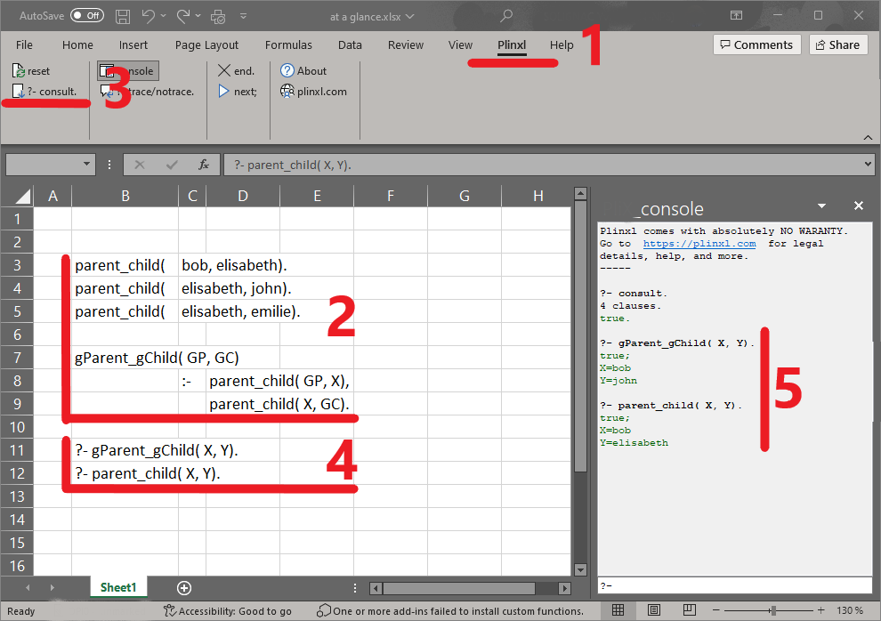

# plinxl
Plinxl is an Excel add-in, providing PROLOG-like capabilities inside excel.

At a glance:

- 1 Download and install Plinxl. 
   In your excel workbook, you now have a 'Plinxl' menu and ribbon.
- 2 In a worksheet, type your prolog program.
-   Or download and open the "plinxl_Tutorial&Examples.xlsx" excel workbook.
- 3 In the Plinxl ribbon click on the '?- consult.' button.
- 4 Double click on a '?- query'.
- 5 Plinxl displays the answer in the console.
-   Click the 'Next' button to backtrack to the next solution, if any.

