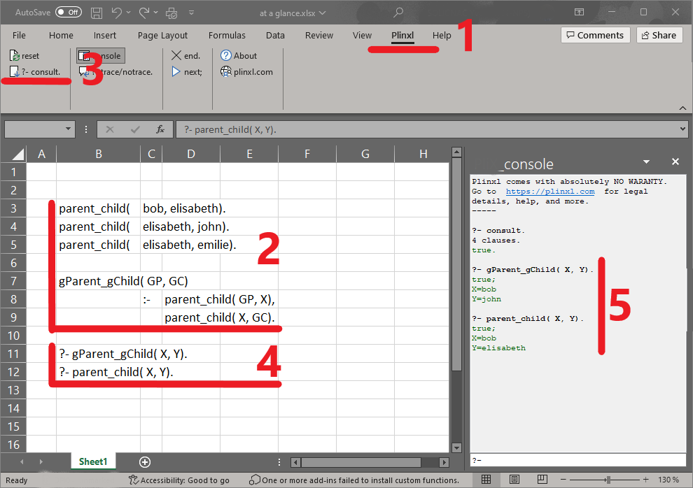

# plinxl
Plinxl is an excel add-in, providing prolog-like capabilities inside excel.

At a glance:

-  Download and install Plinxl. 
   In your excel workbook, you now have a 'Plinxl' menu and ribbon.
-  In a worksheet, type your prolog program.
   In the Plinxl ribbon click on the '?- consult.' button.
-  Double click on a '?- query'.
   Plinxl displays the answer in the console.
-  Click the 'Next' button to backtrack to the next solution, if any.

